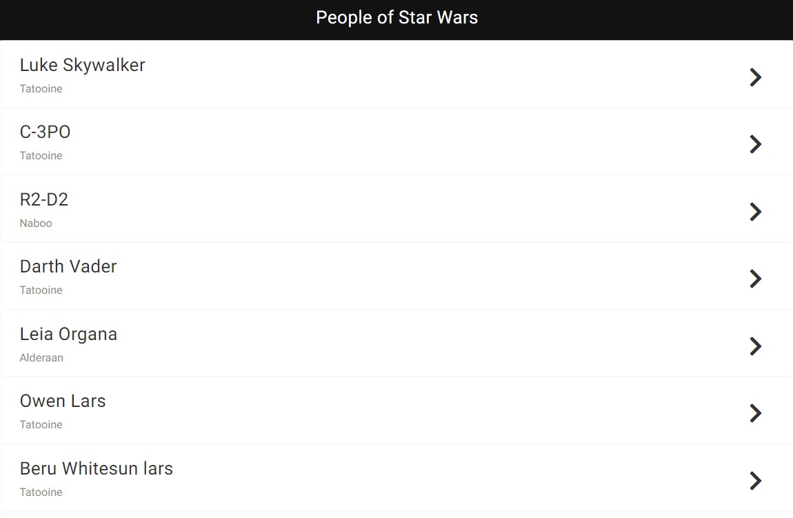
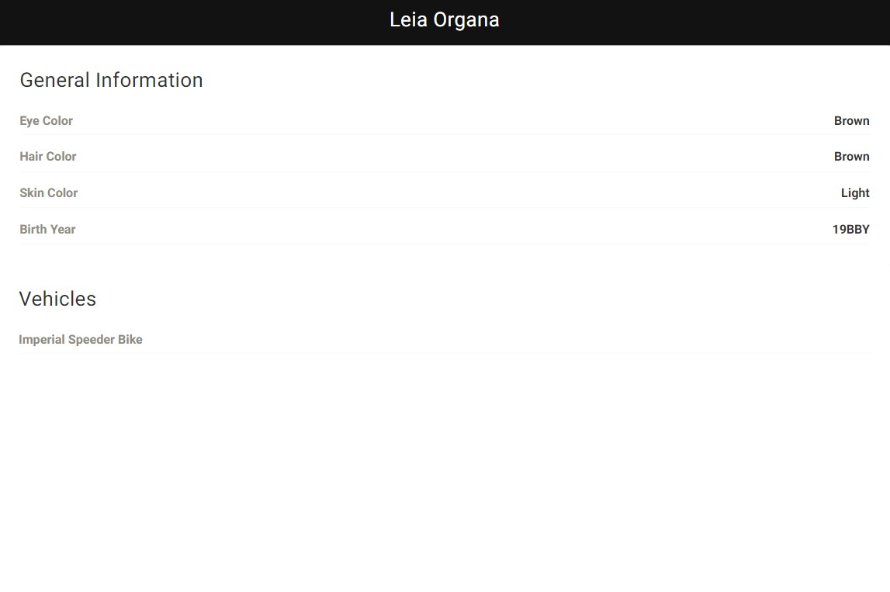

  

<h1 align="center">People of Star Wars</h1>

  <strong>Made by Jenny Cárdenas</strong>
   
  This is an app where the user will be able to see Star Wars characters and the details about them. Build with React and a GraphQL API

  
   ‎ ‎ ‎ ‎
  

## 👩🏼‍💻 About People of Star Wars

## 🔴 Live Demo:

[Try it out](https://peopleofstarwars.netlify.app/)

## 🔧 Built With

- React
- Graphql
- Apollo Client
- HTML5
- CSS3
- JS (ES6)
- VS Code

## 🤖 How it works

To get a local copy up and running follow these simple steps:

- Go to the main page.
- Press the "Code" button and get the repo link.
- Clone it using git command `you_repository_link`.
- Cd into the folder.
- Go to the branch with git checkout `branch-name`.
- Run npm install to install dependencies.
- Run npm start build and start the server.
- To run tests, run npm test.

## 👥 Author

👤 **Jenny Cárdenas**

- GitHub: [@janis_jenny](https://github.com/janis-jenny)
- Twitter: [@janis_jenny](https://twitter.com/janis_jenny)
- LinkedIn: [Jenny Càrdenas](https://www.linkedin.com/in/paolajenny)

## 🤝 Contributing

Contributions, issues, and feature requests are welcome!

Feel free to check the [issues page](https://github.com/janis-jenny/Ravn-Challenge-V2-PaolaCardenas/issues).

## ⭐ Show your support

Give a ⭐️ if you like this project!

## 📌 Acknowledgments

- [TheOdinProjectStar Wars GraphQL API](https://swapi-graphql.netlify.app/.netlify/functions/index)
- [Apollo Docs](https://www.apollographql.com/docs/)
- Stack Overflow
- [Ravn](https://www.ravn.co/) 

## 📝 License

This project is [MIT](https://opensource.org/licenses/MIT) licensed.